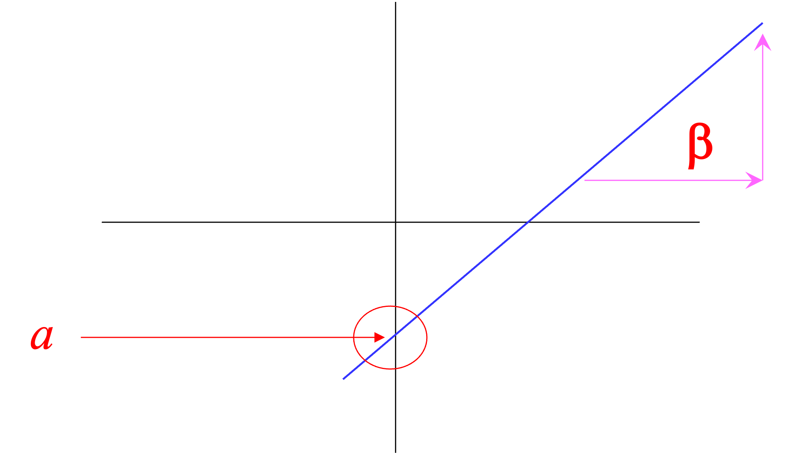
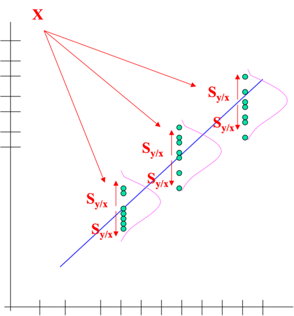
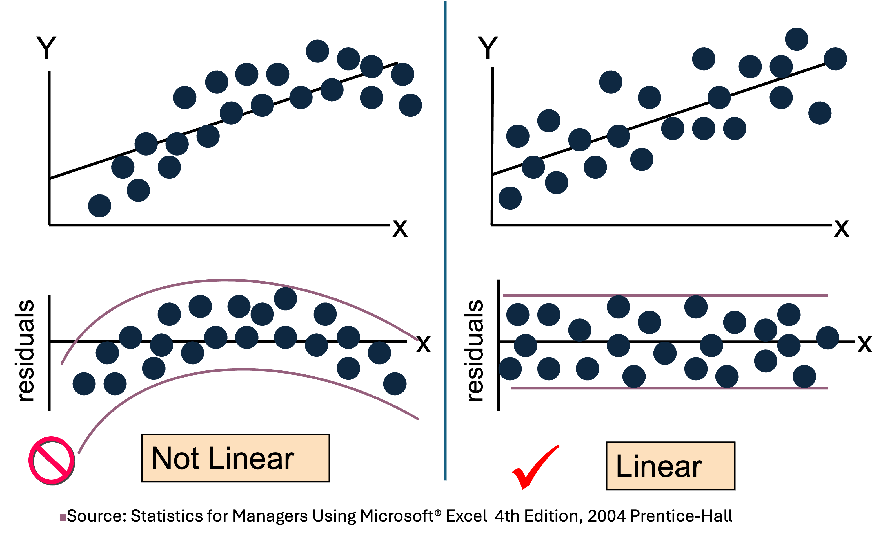
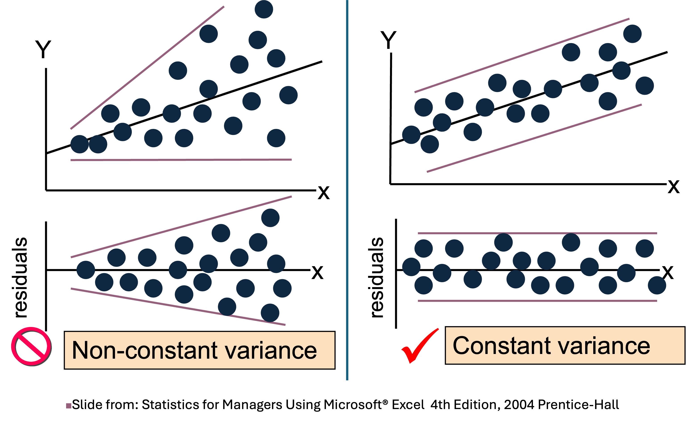

```{r setup, include=FALSE}
options(htmltools.dir.version = FALSE)
```


class: inverse, center, middle

# Testing Hypothesis of Linear Regression

---
# Goals of the lecture

- **Understand the assumptions underlying a regression model.**

- **Understand the implications of violating assumptions.**

- **Evaluate regression model assumptions through visual representations and statistical tests.**

- **Identifying observations within regression models.**


---


# INTRODUCTION- <span style="font-size: 30px;">What is "Linear"?</span>

- Recall that a linear regression model has an equation of the form:

$$ Y= a + \beta X +  \epsilon  $$

where: $Y$ = response, $X$ = predictor, $\beta$ = slope, a = intercept and $\epsilon$ = error term.





---

# Slope & Intercept

## **Slope <span style="font-size: 20px;">(regression coefficient)</span>**

- The rate at which the response variable changes with respect to the predictor variable.

--

- It is the change in the response variable for a one-unit change in the predictor variable.

--

  - A slope of 0.6 means that for every 1-unit change in X, there will be a 0.6-unit change in Y.

--

<br>

## **Intercept**

--

- The value of the response variable when the predictor variable is zero.


---
#CONTD.

- We then use that equation to estimate our $\beta$ parameter(s) and noted that the individual estimates $\hat{\beta}_j$ are typically assumed to follow a **normal distribution** with _mean_ $\beta_j$ and _variance_. 
Such that:
$$\hat{\beta}_j \sim Normal\left(\beta_j, \sigma^2 M_{jj}  \right)$$
where:

**mean** $=$ $\beta_j$, **variance** $=$  $\sigma^2 M_{jj}$, **M** $=$ $\left(X^\top X\right)^{-1}$


<br style="margin-bottom: 20px;">

--

_**But, what about the assumptions underlying the model?**_


---
class: inverse, center, middle

# Assumptions of Linear Regression Models 


---
# Assumptions of linear regression

Basically, model assumptions are explicitly embedded in a model statement,

$$Y_i = \beta_0 + \beta_1 x_{i} + \epsilon_i$$

where $\epsilon_i \sim Normal(0, \sigma^2).$


<br>

--

The assumptions are:

--

- (A): **Linearity**: the response is a linear combination of the predictors. (With noise about this true linear relationship.)

--
- (B): **Independence**: the errors are independent of each other.

--
- (C): **Equality of Variance**: the variance of error is the same at any set of predictor values.

--
- (D): **Normality**: the distribution of the errors typically follow a normal distribution.


--

<br style="margin-bottom: 10px;">

_**Which of those assumptions is most important?**_


---

# Assumptions of linear regression

- The **linearity** assumption is encoded in

$$\beta_0 + \beta_1 x_{i1} + \cdots + \beta_{p-1} x_{i(p-1)}$$

- while the remaining three, are all encoded in

$$\epsilon_i \sim Normal(0, \sigma^2)$$

the $\epsilon_i$ are $iid$ normal random variables with equal variance.

--

<br style="margin-bottom: 10px;">

- If these assumptions are satisfied, then that's **excellent**! We can make inference, and our conclusions will be reliable.

--

- However, if these assumptions are not fulfilled, we can still perform some test (e.g.,  a t-test in R), but the outcomes will lack **validity**. The distributions of parameter estimates will deviate from expectations, leading to erroneous acceptance or rejection of hypotheses.


---
class: inverse, center, middle

# Assessing Model Assumptions

---

# <span style="font-size: 40px;">How do we assess our model assumptions?</span>


## 1. Fitted vs Residuals Plot

This is one of the most important metrics in checking model assumptions, especially for linearity and equal variance.


To demonstrate this method, we can work with (simulated) data from three models:

--
  - Simulation involves generating (artificial) data that mimic real-world scenarios. 

--

  - To explore the behaviour of the method, assess the performance, test hypotheses, and gain insights into the underlying processes without relying solely on empirical data


---

# Generate the data

$$ \text{Model A:} \quad Y = 2 + 10x + \epsilon, \quad \epsilon \sim Normal(0, x^2)$$

$$\text{Model B:} \quad Y = 2 + 10x + \epsilon, \quad \epsilon \sim Normal(0, 1)$$

$$\text{Model C:} \quad Y = 2 + 10x^2 + \epsilon, \quad \epsilon \sim Normal(0, 16)$$


<br style="margin-bottom: 10px;">

--
_**Which of the three models defined above do you think would not violate any assumptions?**_


```{r, echo = FALSE}
#---
# Define the function for the models

mod_1 = function(sample_size = 1000) {
  x = runif(n = sample_size) * 10
  y = 2 + 10 * x + rnorm(n = sample_size, mean = 0, sd = x)
  data.frame(x, y)
}

mod_2 = function(sample_size = 1000) {
  x = runif(n = sample_size) * 10
  y = 2 + 10 * x + rnorm(n = sample_size, mean = 0, sd = 1)
  data.frame(x, y)
}

mod_3 = function(sample_size = 1000) {
  x = runif(n = sample_size) * 10
  y = 2 + 10 * x ^ 2 + rnorm(n = sample_size, mean = 0, sd = 4)
  data.frame(x, y)
}
```


---
# <span style="font-size: 40px;">Fitted vs residual plot using (simulated) data:</span>

Since we said **model B** will show almost no sign of model violation, we'll use that to demonstrate what a "good" plot looks like.


```{r, echo = FALSE}
set.seed(99)
data_1 = mod_2()
#head(data_1)

```

--
.pull-left[
- Add the fitted line to the scatterplot.
```{r, echo = FALSE, fig.height = 7, fig.width = 6}
plot(y ~ x, data = data_1, col = "grey", pch = 20, main = "Model B")
fit_1 = lm(y ~ x, data = data_1)
abline(fit_1, col = "darkred", lwd = 3)
```

]

--
.pull-right[
- Add the fitted vs residuals plot.
```{r, echo = FALSE, fig.height = 7, fig.width = 6}
plot(fitted(fit_1), resid(fit_1), col = "grey", pch = 20,
     xlab = "Fitted", ylab = "Residuals", main = "Model B")
abline(h = 0, col = "darkred", lwd = 2)
```
]


---
# Evaluate model assumptions


Two things here:

--

1. For each fitted value, residuals should be ~ $0$. If this is true, the assumption of **linearity** is met. Hence, why we added a line at $y = 0$.

--

2. At every fitted value, the spread/dispersion of the residuals should be relatively constant. If so, the assumption of **equal variance** holds true.

<br>

--

Here, we can observe that both conditions are satisfied. The residuals are centered around zero, and the spread of the residuals is consistent across the range of fitted values. 


---

# <span style="font-size: 30px;">A case of violated assumptions (equal variance)</span>


Now, lets check an instance where  one of the assumptions is violated.


--

<div class="side-note">
      <p>
        The standard error of Y|X is the average variability observed around the regression line for any value of X. It is often assumed to be equal across all values of X.
      </p>
      
      This is known as the assumption of homoscedasticity or equal variance.
      
      </p>

</div>  


              


---

# <span style="font-size: 30px;">A case of violated assumptions (equal variance)</span>

We can use **model A** to demonstrate this:
$$ \text{Model A:} \quad Y = 2 + 10x + \epsilon, \quad \epsilon \sim Normal(0, x^2)$$

--
.pull-left[

```{r, echo = FALSE,fig.height = 6.5, fig.width = 6}
set.seed(99)
data_2 = mod_1()
fit_2 = lm(y ~ x, data = data_2)
plot(y ~ x, data = data_2, col = "grey", pch = 20, main = "Model A")
abline(fit_2, col = "darkred", lwd = 3)
```
]

--
.pull-right[

```{r, echo = FALSE,fig.height = 6.5, fig.width = 6}
plot(fitted(fit_2), resid(fit_2), col = "grey", pch = 20,
     xlab = "Fitted", ylab = "Residuals", main = "Model A")
abline(h = 0, col = "darkred", lwd = 2)
```
]

---

# CONTD.


```{css echo=FALSE}
.side-note {
  position: absolute;
  top: 50%;
  right: 10px;
  transform: translateY(-50%);
  width: 300px; 
  background-color: #f0f0f0;
  padding: 10px;
  border: 1px solid #ccc;
}
```


Here, two observations are obvious here.

--
- Firstly, the residuals appear to be roughly centered around 0 for any given fitted value, indicating that the **linearity** assumption holds. 

--

- However, it's also evident that for higher fitted values, the spread of the residuals increases, indicating a violation of the **constant variance** assumption.


---

```{css echo=FALSE}
.side-note {
  position: absolute;
  top: 50%;
  right: 10px;
  transform: translateY(-50%);
  width: 300px; 
  background-color: #f0f0f0;
  padding: 10px;
  border: 1px solid #ccc;
}

.plot-container {
  display: flex;
  justify-content: space-between; /* Add space between the plots */
}

.plot-container img {
  width: 300%; 
}
```


# <span style="font-size: 35px;">A case of Violated assumptions (linearity)</span>


- Next, we will illustrate a model that fails to satisfy the **linearity** assumption.

--

- Recall _Model C_: $$\quad Y = 2 + 10x^2 + \epsilon, \hspace3ex \epsilon \sim Normal(0, 16)$$


--

- **Model C** serves as an example where $(Y)$ is not a linear combination of the predictor. In this scenario, the predictor is $(x)$, but the model incorporates $(x^2)$.


---

#CONTD.

.pull-left[
- Add the fitted line to the scatterplot.

```{r, echo = FALSE,fig.height = 7, fig.width = 6}

set.seed(99)
data_3 = mod_3()
fit_3 = lm(y ~ x, data = data_3)


#par(mfrow=c(1,2)) 
plot(y ~ x, data = data_3, col = "grey", pch = 20, main = "Model C")
abline(fit_3, col = "darkred", lwd = 3)

```
]


--

.pull-right[
- Plot the fitted vs residuals.

```{r, echo = FALSE,fig.height = 7, fig.width = 6}


plot(fitted(fit_3), resid(fit_3), col = "grey", pch = 20,
     xlab = "Fitted", ylab = "Residuals", main = "Model C")
abline(h = 0, col = "darkorange", lwd = 2)


```

]

---
# CONTD

```{css echo=FALSE}
.side-note {
  position: absolute;
  top: 50%;
  right: 10px;
  transform: translateY(-50%);
  width: 300px; 
  background-color: #f0f0f0;
  padding: 10px;
  border: 1px solid #ccc;
}
```


- Here, the linearity assumption is violated. The residuals are not centered around zero for any given fitted value. This is a clear indication that the model is not capturing the true relationship between the predictor and the response.


---

# <span style="font-size: 30px;">Residual Plot for Linearity</span>




---

# <span style="font-size: 30px;">Residual Plot for equal variance</span>




---
class: inverse, center, middle

# Normality Assumption


---

#Assess Normality assumption

**Histogram** and **QQ plot** are used to assess the normality assumption. The histogram is used to visualize the distribution of the residuals, while the QQ plot is used to compare the distribution of the residuals to the normal distribution.

--

- Histogram

```{r, echo=FALSE, fig.height=5, fig.width=15}
par(mfrow = c(1, 3))
hist(resid(fit_2),
     xlab   = "Residuals",
     main   = "A",
     col    = "darkorange",
     border = "dodgerblue",
     breaks = 20)
hist(resid(fit_1),
     xlab   = "Residuals",
     main   = "B",
     col    = "darkorange",
     border = "dodgerblue",
     breaks = 20)
hist(resid(fit_3),
     xlab   = "Residuals",
     main   = "C",
     col    = "darkorange",
     border = "dodgerblue",
     breaks = 20)
```


--

**_Looking at the above plots, can you tell me which one appears normal or not?_**


---

# <span style="font-size: 40px;">The quantile-quantile (QQ) plot</span>

- **Quantiles** (`percentiles`) are points in your dataset below which a certain proportion of your data falls. 

<br>

--
- `QQ plot` then serves as a visual tool to check whether your data likely originates from a certain theoretical distribution (e.g., normal or exponential distributions).

<br>

--

- Compares the sample quantiles to the quantiles of a theoretical distribution

<br>

--
- If the two sets of quantiles come from the same distribution, the points will closely follow the line

<br>

--
- QQ plot is just a **visual** check and so, somewhat subjective


---

# <span style="font-size: 40px;">The quantile-quantile (QQ) plot</span>


Let's create a Q-Q plot for the residuals of `fit_1`.

--

```{r, echo=FALSE, fig.height=5.5, fig.width=14}
#We can use the `qqnorm()` function in `R` to plot the points, and adds the line to the plot using the #`qqline()` function. 

#par(mfrow = c(1, 3))
qqnorm(resid(fit_1), main = "Normal Q-Q Plot, fit_1", col = "darkgrey")
qqline(resid(fit_1), col = "dodgerblue", lwd = 2)
```

--

- If the data points are "close to the line", then the data is *normally* distributed.
- y-axis = observed (sample quantiles), and x-axis = expected values (theoretical quantiles).


---

# <span style="font-size: 25px;">More on Q-Q Plots</span> <span style="font-size: 20px;">(Normal Q-Q Plot from normal & Exponential distribution)</span>

Simulate data from normal distribution to see how "good" Q-Q plot looks like.


```{r, echo=FALSE, fig.height=7.5, fig.width=15}

par(mfrow = c(1, 3))
qqnorm(rnorm(200), main = "Normal Q-Q Plot, Normal Distribution", col = "darkgrey")
qqline(rnorm(200), col = "dodgerblue", lwd = 2)

qqnorm(rnorm(300), main = "Normal Q-Q Plot, Normal Distribution", col = "darkgrey")
qqline(rnorm(300), col = "dodgerblue", lwd = 2)

qqnorm(rnorm(400), main = "Normal Q-Q Plot, Normal Distribution", col = "darkgrey")
qqline(rnorm(400), col = "dodgerblue", lwd = 2)


```


---

# <span style="font-size: 30px;">QQ Plot from exponential distribution</span> 

Now, let's simulate data from an exponential distribution and see how the Q-Q plot looks like.

```{r, echo=FALSE, fig.height=8, fig.width=15}

par(mfrow = c(1, 3))
qqnorm(rexp(200), main = "Normal Q-Q Plot, Exponential Distribution", col = "darkgrey")
qqline(rexp(200), col = "dodgerblue", lwd = 2)

qqnorm(rexp(300), main = "Normal Q-Q Plot, Exponential Distribution", col = "darkgrey")
qqline(rexp(300), col = "dodgerblue", lwd = 2)

qqnorm(rexp(400), main = "Normal Q-Q Plot, Exponential Distribution", col = "darkgrey")
qqline(rexp(400), col = "dodgerblue", lwd = 2)


```


---

# <span style="font-size: 40px;">Back to our (simulated) data</span>

Recall that `fit_1` did not violate any assumption, `fit_2` violated the homogeneity of variance assumption, and `fit_3` violated the linearity assumption.

--

```{r, echo=FALSE, fig.height=7, fig.width=15}
#So, going back to our simulated data, let's create and compare Q-Q plots for `fit_1`, `fit_2`, and `fit_3`.

par(mfrow = c(1, 3))
qqnorm(resid(fit_2), main = "Normal Q-Q Plot, fit_2", col = "darkgrey")
qqline(resid(fit_2), col = "dodgerblue", lwd = 2)

qqnorm(resid(fit_1), main = "Normal Q-Q Plot, fit_1", col = "darkgrey")
qqline(resid(fit_1), col = "dodgerblue", lwd = 2)

qqnorm(resid(fit_3), main = "Normal Q-Q Plot, fit_3", col = "darkgrey")
qqline(resid(fit_3), col = "dodgerblue", lwd = 2)


```

--
Looking at the above plots, can you tell me which one appears normal or not?


---
class: inverse, center, middle

# Formal (statistical) Tests

---

# Statistical Test

Another more formal test that can be used to test the assumption of equality of variance is the **Levene Test and Breusch-Pagan Test**.

--

- Equal variance == **Homogeneity of Variance or Homoscedasticity**.

- Unequal variance == **Heteroscedasticity or heterogeneity of variance**. 


--

The Levene Test can be performed using the `leveneTest` function from the `car` package. While the Breusch-Pagan Test can be performed using the `bptest` function from the `lmtest` package.

```{r, echo = FALSE}
#install.packages("car", dependecies=TRUE)
library(car)
#install.packages("lmtest")
library(lmtest)
```

<br>

--
The null and alternative hypotheses are as follows:


$H_0$: Homoscedasticity. The errors maintain equal variance about the true model.

$H_a$: Heteroscedasticity.  The errors exhibit non-equal variance about the true model.


---
# Fit the model

To demonstrate how to use `Breusch-Pagan` test, we will use the three models we have been working with. 

--

Remember,

- `fit_1` had no violation of assumptions (both linearity and equal variance were satisfied),

<br>
--

- `fit_2` linearity holds but violated the equal variance assumption,

<br>
--

- `fit_3` equal variance holds, but violated linearity


---

# Breusch-Pagan Test

The Breusch-Pagan test assesses whether the variance of the residuals in a regression model is constant across different values of the predictor variable.

--

.pull-left[
- model_1 - `bptest(fit_2)`

```{r, echo = FALSE}
bptest(fit_2)
```
]

--
.pull-right[

- model_2 - `bptest(fit_1)`

```{r, echo = FALSE}
bptest(fit_1)
```
]

<br>
--

- model_3 - `bptest(fit_3)`

```{r, echo = FALSE}
bptest(fit_3)
```


---

# <span style="font-size: 40px;"> Levene Test</span> 

`Levene` test can be used to assess the equality of variances across different groups.

To demonstrate its usefulness, let's use `Circadian_Data.csv` dataset.

--
.pull-left[

**For context**: the data is about jet lag and adjusting to a different time zone. Campbell and Murphy (1998) claimed people adjust to their new time zone once the light reset their internal, circadian clock. Wright and Czeisler 2002 revisited this study and measured the melatonin production. They subjected 22 people to random treatments; control, knees only and eyes.

Here, we want to compare phase shifts in the circadian rhytm of melatonin productions in participants given another light treatments.

]

--

.pull-right[

```{r, echo = FALSE}

Circadian <- read.csv("Circadian_Data.csv") # Load the csv named "Circadian"
#order the treatment
Circadian$treatment = ordered(Circadian$treatment, levels = c("control","eyes", "knee"))
# Check your levels now
#levels(Circadian$treatment)
Circadian_anova <- lm( shift ~ treatment, data=Circadian) # Fit the model
#anova(Circadian_anova)
leveneTest(shift ~ factor(treatment), data=Circadian)

```


<br>

The P value is > 0.05, there is no evidence to reject the $H_0$ (they have the same variance) and the assumption of **homogeneity** is met

]


---

# Shapiro Wilk Test

Shapiro-Wilk test is another test that can be used to test the **normality** of the residuals. The null hypothesis of the test is that the data is normally distributed.

We can use the `shapiro.test()` function in `R` to perform the test.

<br>

--

The null and alternative hypotheses are as follows:

$H_0$: The data is normally distributed.

$H_a$: The data is not normally distributed.


---
# Shapiro Wilk Test

.pull-left[
- Model_1 - `shapiro.test(resid(fit_2))`

```{r, echo=FALSE}
shapiro.test(resid(fit_2))
```

]

--

.pull-right[

- Model_2 - `shapiro.test(resid(fit_1))`


```{r, echo=FALSE}
shapiro.test(resid(fit_1))
```
]

--

- Model_3 - `shapiro.test(resid(fit_3))`


```{r, echo=FALSE}
shapiro.test(resid(fit_3))
```


---
class: inverse, center, middle

# Using real data to assess model assumptions


---

# Example with real data

To assess model assumptions using real data, we'll use the **`Lion Nose`** dataset.

.pull-left[
**Context**: Trophy hunting is frequently used (in a sustainable manner) to keep lion populations stable and to raise funds for conservation projects. Targeting older lions who have surpassed their breeding age has minimal effect on their population. However, hunting younger lions can lead to potential instability within the population. Here, Whitman and colleagues (2004) investigated the relationship between the blackness of a male lion's nose and its age.

]

.pull-right[


(source: [National Geographic](https://www.nationalgeographic.com/animals/mammals/facts/african-lion))

]


---

# Load the data and Fit the model


```{r, echo=FALSE, fig.height = 6.5, fig.width = 8}

Lion = read.csv("LionNose.csv")
mod_fit <- lm(Age ~ PropBlack , data = Lion)

plot(Age ~ PropBlack, data = Lion, col = "blue", pch = 20, main = " Age (in Years) vs Prop. of Black")
abline(mod_fit, col = "darkred", lwd = 3)

```


---
# Load the data and Fit the model

```{r, echo=FALSE, fig.height = 6.5, fig.width = 8}

summary(mod_fit)
```


---

# Check for homogeneity of variance

.pull-left[

```{r, echo = FALSE, fig.height = 6.5, fig.width = 8}

plot(fitted(mod_fit), resid(mod_fit), col = "blue", pch = 20,
     xlab = "Fitted", ylab = "Residual",
     main = "iris: Fitted vs Residuals")
abline(h = 0, col = "darkorange", lwd = 2)

```

]


--

.pull-right[

```{r, echo=FALSE,fig.height = 6.5, fig.width = 8}

bptest(mod_fit)


```


]

--

Here, the P value is < 0.05, thus, we have evidence to reject the $H_0$ (equal variance assumption is violated). Put simply, the residuals are **heteroscedastic**.


---

# Normality Assumption

We will use the qqnorm to check for normality assumption and verify this using the shapiro test.

.pull-left[

```{r, echo=FALSE, fig.height=6.5, fig.width=8}
qqnorm(resid(mod_fit), col = "darkgrey")
qqline(resid(mod_fit), col = "dodgerblue", lwd = 2)
```
]

--

.pull-right[


- Confirm with Shapiro Wilk Test

```{r, echo=FALSE,fig.height = 6.5, fig.width = 8}
shapiro.test(resid(mod_fit))
```

]

--

From the Shapiro normality test, with a P-value > 0.05, we have 'evidence' to conclude that this data is consistent with a normal distribution, as such **normality assumption** is met. 


